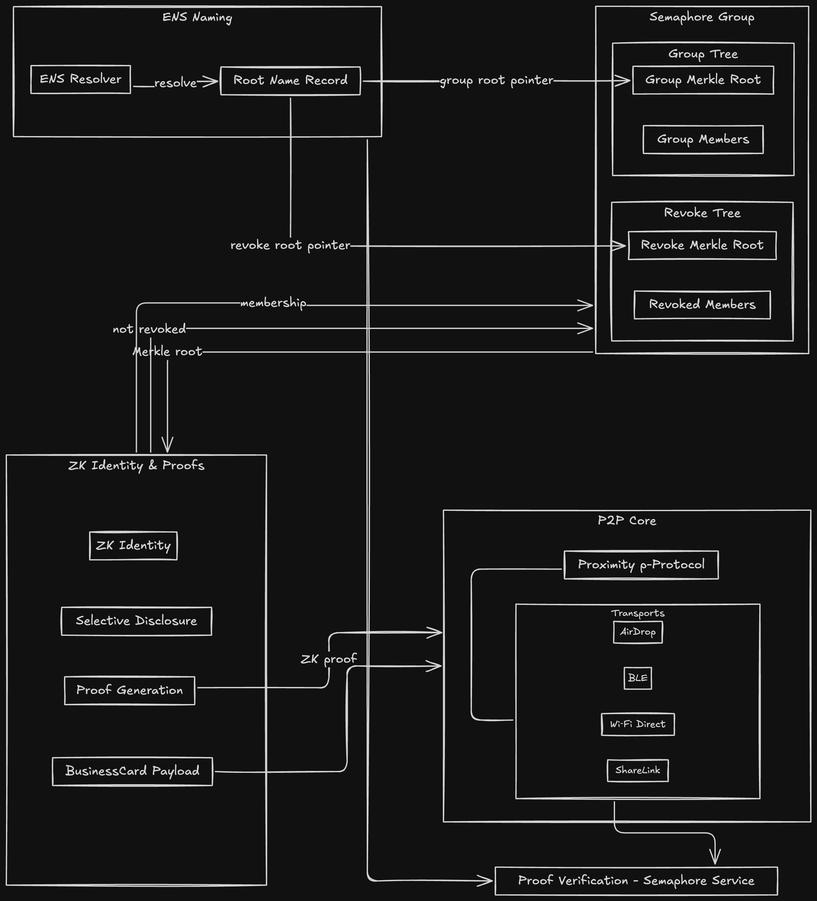

<div align="center">
<h1>Luft Deck</h1>
<p>A privacy-preserving, proximity-based business card sharing app built with zero-knowledge proofs and P2P networking.</p>

</img>


</div>

## Project Description

Luft Deck is a revolutionary business card sharing application that combines proximity-based networking with zero-knowledge (ZK) proofs to enable secure, privacy-preserving contact exchange. 

Built for iOS, the app allows users to share business cards through multiple channels while maintaining complete control over their personal information through selective disclosure mechanisms.

### Key Features

- **Proximity-Based Sharing**: Exchange business cards with nearby devices using AirDrop, QRcode, Wi-Fi Direct, and ShareLink
- **Zero-Knowledge Identity**: Built on Semaphore protocol for anonymous group membership and selective disclosure
- **Mopro Integration**: Native zero-knowledge proof generation using Mopro's Swift bindings for enhanced performance
- **ENS Integration**: Ethereum Name Service (ENS) resolution for decentralized identity management
- **Privacy Controls**: Granular sharing preferences with public, professional, and personal levels
- **Group Management**: Create and manage Semaphore groups for verified communities
- **Web3 Authentication**: Seamless login with Web3Auth supporting Apple ID and email
- **Offline-First**: Works without internet connection using local P2P protocols

## Technologies Used

- **SwiftUI** - Modern iOS UI framework
- **MultipeerConnectivity** - Apple's P2P networking framework
- **Semaphore Protocol** - Zero-knowledge proof system for anonymous group membership
- **Mopro** - Zero-knowledge proof framework with native Swift bindings
- **Web3Auth** - Web3 authentication and wallet management
- **ENS (Ethereum Name Service)** - Decentralized naming system
- **Core Data** - Local data persistence
- **PassKit** - Apple Wallet integration
- **Combine** - Reactive programming framework
- **Web3.swift** - Ethereum blockchain interaction

## Basic Architecture



### Core Components

1. **Identity Management**: Semaphore-based ZK identity with group membership proofs
2. **Proximity Sharing**: Multi-channel P2P communication for local device discovery
3. **Privacy Controls**: Selective disclosure with configurable sharing levels
4. **Group Management**: Semaphore group creation and member management
5. **ENS Integration**: Decentralized naming and group root resolution
6. **Web3 Authentication**: Seamless blockchain-based authentication

## Source Code

- **License**: Apache 2.0
- **Main Target**: iOS 18.0+
- **App Clip**: Available for quick sharing without full app installation

## Deployment

### iOS App Store
- **Status**: In Development
- **Target Release**: Q4 2025
- **Requirements**: iOS 18.0 or later
- **Device Compatibility**: iPhone, iPad

### App Clip
- **Purpose**: Quick business card sharing without full app installation
- **Features**: Basic proximity sharing and QR code scanning
- **Size**: < 20MB

## Installation

### Prerequisites
- Xcode 15.0 or later
- iOS 16.0+ deployment target
- Apple Developer Account (for device testing)

### Build Instructions

1. Clone the repository:
```bash
git clone https://github.com/kidneyweakx/Luft-Deck.git
cd airmeishi
```

2. Open the project in Xcode:
```bash
open airmeishi.xcodeproj
```

3. Install dependencies:
   - The project uses Swift Package Manager
   - Dependencies will be automatically resolved when opening in Xcode

4. Configure signing:
   - Select your development team in project settings
   - Update bundle identifier if needed

5. Build and run:
   - Select target device or simulator
   - Press Cmd+R to build and run

### Dependencies

- **SemaphoreSwift**: Zero-knowledge proof implementation
- **MoproFFI**: Zero-knowledge proof framework with native Swift bindings
- **Web3Auth**: Web3 authentication SDK
- **Web3.swift**: Ethereum blockchain interaction

## Usage

### Creating a Business Card
1. Launch the app and complete Web3 authentication
2. Navigate to "My Card" tab
3. Fill in your information (name, title, company, etc.)
4. Configure sharing preferences and privacy levels
5. Select an animal character for visual identification

### Sharing Business Cards
1. Go to "Share" tab
2. Choose sharing level (Public, Professional, Personal)
3. Start advertising to make your card discoverable
4. Nearby devices will see your card in their "Discover" list
5. Tap to connect and exchange cards

### Group Management
1. Navigate to "Groups" tab
2. Create a new Semaphore group or join existing ones
3. Invite members through proximity sharing
4. Manage group membership and permissions

## Privacy & Security

- **Zero-Knowledge Proofs**: Verify group membership without revealing identity
- **Selective Disclosure**: Control exactly what information to share
- **Local-First**: All data stored locally, no cloud dependency
- **End-to-End Encryption**: All P2P communications are encrypted
- **No Tracking**: No analytics or user tracking

## Contributing

We welcome contributions! Please see our [Contributing Guidelines](CONTRIBUTING.md) for details.

### Development Setup
1. Fork the repository
2. Create a feature branch
3. Make your changes
4. Add tests if applicable
5. Submit a pull request

## License

This project is licensed under the Apache 2.0 - see the [LICENSE](LICENSE) file for details.

## Acknowledgments

- [Semaphore Protocol](https://semaphore.appliedzkp.org/) for zero-knowledge proof implementation
- [Mopro](https://zkmopro.org/) for zero-knowledge proof framework with native mobile bindings
- [Web3Auth](https://web3auth.io/) for Web3 authentication
- [ENS](https://ens.domains/) for decentralized naming
- Apple's MultipeerConnectivity framework for P2P networking

## Roadmap

- [ ] Desktop applications
- [ ] Advanced group management features
- [ ] Integration with more blockchain networks
- [ ] Enhanced privacy controls
- [ ] Analytics dashboard for groups

## Support

- **Email**: support@knyx.dev

---

**Luft Deck** - Privacy-preserving business card sharing for the decentralized web.
